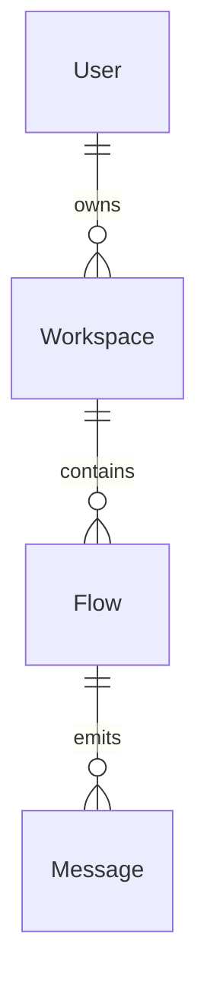

# 🧬 Data Modeling & Domain Structure

> This document defines the core entities, relationships, and business rules that shape the product’s data architecture.  
> It serves as the canonical reference for designing schemas, APIs, storage layers, and event flows.

---

## 🎯 Purpose

To provide a shared, centralized model of the domain — enabling agents and developers to reason consistently about how data is structured, validated, and connected.

---

## 🧠 Used by Agents

- **Forge**: for schema generation, API scaffolding, and object modeling
- **Shield**: for validation, constraints, and integrity enforcement
- **Scroll**: for describing data flows and storage policies
- **Pulse**: for aligning business logic with data design

---

## 🧩 Core Entities

| Entity       | Description                               | Primary Keys     | Notes                      |
|--------------|-------------------------------------------|------------------|----------------------------|
| `User`       | Represents an account in the platform     | `user_id` (UUID) | Includes metadata and auth |
| `Workspace`  | A user-owned container for operations     | `workspace_id`   | Can contain multiple flows |
| `Flow`       | A modular, reusable automation sequence   | `flow_id`        | Versionable               |
| `Message`    | Represents a message or transaction       | `message_id`     | Tied to a specific flow    |

> Describe entities in business-first language. Link to schema or SQL definitions where relevant.

---

## 🔗 Relationships

- A `User` can own multiple `Workspaces`
- Each `Workspace` contains many `Flows`
- A `Flow` generates multiple `Messages`
- `Messages` may reference external payloads or state snapshots

---

## ✅ Business Rules & Constraints

- User emails must be unique and verified before creating a workspace
- Flows must be versioned immutably (no overwrite)
- Messages cannot be deleted once persisted
- Entity `X` must reference valid entity `Y` before operation

---

## 📁 Storage Mapping

| Entity     | DB Table / Collection     | Notes                           |
|------------|---------------------------|----------------------------------|
| `User`     | `users` (PostgreSQL)      | Indexed by `email`, `created_at`|
| `Flow`     | `flows` (PostgreSQL)      | JSONB column for config blob     |
| `Message`  | `messages` (S3 + DynamoDB)| Blobs stored separately          |

> Optionally include links to schema files, ORMs, or infrastructure templates.

---

## 🧠 Schema Versioning Strategy

- Use timestamp-based migration files
- Maintain backward compatibility for APIs
- Breakage requires a new versioned `flow` or `schema_ref`
- Agents must refer to `schema_version` when interacting with persisted state

---

## 🧪 Example: Data Flow Summary

---

## ✅ Compliance Checklist

- [ ] Are all key entities described with purpose and keys?
- [ ] Are relationships clearly defined with cardinality?
- [ ] Are business rules and constraints documented?
- [ ] Is the storage or database mapping included?
- [ ] Is the schema versioning approach described?
- [ ] Are agents explicitly told how to use this file?

---

## 📚 Reference Links

- [Martin Fowler – Data Modeling Patterns](https://martinfowler.com/articles/orm.html)
- [PostgreSQL Best Practices](https://www.postgresql.org/docs/current/index.html)
- [Prisma Schema Reference](https://www.prisma.io/docs/reference/api-reference/prisma-schema-reference)
- [JSON Schema Versioning Strategies](https://json-schema.org/understanding-json-schema/structuring.html#schema-versioning)
